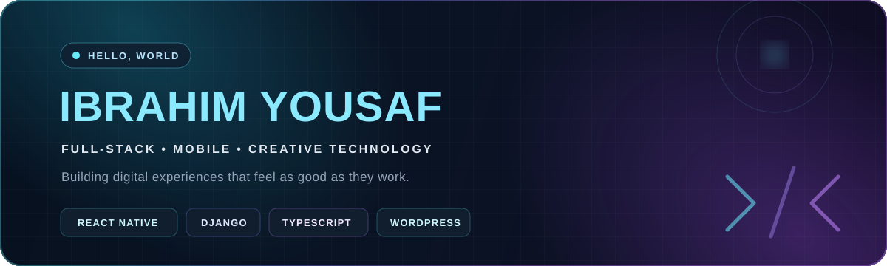

  

  
  
  

## About me

I'm **Ibrahim Yousaf**, a full-stack and mobile developer who enjoys turning ideas into thoughtful, polished digital products. My work spans cross-platform applications, modern web experiences, content platforms, and applied machine-learning research.

<table>
  <tr>
    <td width="50%" valign="top">
      <h3>What I build</h3>
      <ul>
        <li>Cross-platform apps with React Native and Expo</li>
        <li>Modern interfaces with React and TypeScript</li>
        <li>Full-stack products powered by Python and Django</li>
        <li>Flexible websites and content systems with WordPress</li>
      </ul>
    </td>
    <td width="50%" valign="top">
      <h3>What I care about</h3>
      <ul>
        <li>Interfaces that feel clear, responsive, and intentional</li>
        <li>Maintainable code and reusable design systems</li>
        <li>Useful technology with a strong product perspective</li>
        <li>Continuous learning across ML and deep learning</li>
      </ul>
    </td>
  </tr>
</table>

## Technology toolkit

  
  
  
  
  
  
  
  
  
  
  
  

## Featured work

### [BLANC Living Mobile](https://github.com/benzibrahim/blanc-living-mobile)

A refined React Native and Expo experience for luxury garment care. It includes a complete editorial home page, eight service journeys, studio and membership experiences, client booking, account screens, local order tracking, responsive navigation, and a reusable mobile design system.

`React Native` · `Expo` · `TypeScript` · `Mobile UI` · `Responsive Design`

## GitHub snapshot

  
  

  

## Let's connect

I'm always interested in thoughtful software, strong product ideas, and opportunities to build useful experiences.

  
  

---

  <strong>Build with purpose. Polish every detail. Keep learning.</strong>

