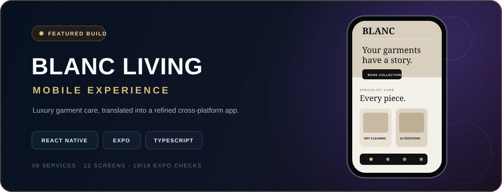

<p align="center">
  
</p>

<p align="center">
  <a href="https://git.io/typing-svg">
    
  </a>
</p>

<p align="center">
  <a href="https://github.com/benzibrahim?tab=followers"></a>
  <a href="https://github.com/benzibrahim?tab=repositories"></a>
  
</p>

---

## `> identity.init()`

```yaml
developer:
  name: Ibrahim Yousaf
  role: Full-Stack & Mobile Developer
  builds: Cross-platform apps, web products, and content platforms
  frontend: React Native, Expo, React, TypeScript, JavaScript
  backend: Python, Django
  creative: WordPress, responsive UI, digital strategy
  research: Machine learning and deep learning
  principle: "Build with purpose. Polish every detail. Keep learning."
```

I turn product ideas into clear, responsive experiences—from refined mobile interfaces to practical full-stack systems. I care about the layer users see and the architecture that keeps everything underneath maintainable.

---

## `> flagship.build`

<a href="https://github.com/benzibrahim/blanc-living-mobile">
  
</a>

### [BLANC Living Mobile](https://github.com/benzibrahim/blanc-living-mobile)

```yaml
project: Premium garment-care mobile experience
role: End-to-end React Native implementation
experience:
  - Editorial, animated home journey
  - Eight specialist service flows
  - Four-step collection booking
  - Studios, bridal, membership, business, account, and order screens
  - Center-snapping cards, FAQs, responsive navigation, and keyboard-safe forms
engineering:
  stack: [React Native, Expo, TypeScript]
  architecture: Typed routes, reusable UI primitives, centralized theme and content
  quality: Expo Doctor 18/18, clean TypeScript validation
```

<p align="center">
  <a href="https://github.com/benzibrahim/blanc-living-mobile"></a>
</p>

---

## `> technology.matrix`

### Mobile & frontend

<p>
  <a href="https://reactnative.dev/"></a>&nbsp;
  <a href="https://expo.dev/"></a>&nbsp;
  <a href="https://www.typescriptlang.org/"></a>&nbsp;
  <a href="https://developer.mozilla.org/docs/Web/JavaScript"></a>&nbsp;
  <a href="https://developer.mozilla.org/docs/Web/HTML"></a>&nbsp;
  <a href="https://developer.mozilla.org/docs/Web/CSS"></a>
</p>

### Backend, content & research

<p>
  <a href="https://www.python.org/"></a>&nbsp;
  <a href="https://www.djangoproject.com/"></a>&nbsp;
  <a href="https://wordpress.org/"></a>&nbsp;
  &nbsp;
  
</p>

### Workflow

<p>
  <a href="https://git-scm.com/"></a>&nbsp;
  <a href="https://github.com/"></a>&nbsp;
  <a href="https://code.visualstudio.com/"></a>&nbsp;
  
</p>

---

## `> github.telemetry`

<p align="center">
  
</p>

<p align="center">
  
  
</p>

<p align="center">
  
  
</p>

---

## `> current.signal`

```typescript
const currentFocus = {
  building: [
    "polished cross-platform mobile experiences",
    "maintainable full-stack products",
    "responsive interfaces with strong visual systems",
  ],
  sharpening: ["TypeScript", "React Native architecture", "product thinking"],
  exploring: ["machine learning", "deep learning", "intelligent user experiences"],
  mindset: "Make it useful, make it clear, then make it memorable.",
};
```

---

## `> build.loop`

<p align="center">
  
</p>

---

## `> contribution.arcade`

<picture>
  <source media="(prefers-color-scheme: dark)" srcset="https://raw.githubusercontent.com/benzibrahim/benzibrahim/output/github-contribution-grid-snake-dark.svg" />
  <source media="(prefers-color-scheme: light)" srcset="https://raw.githubusercontent.com/benzibrahim/benzibrahim/output/github-contribution-grid-snake.svg" />
  
</picture>

<p align="center"><sub>The contribution snake refreshes automatically every day.</sub></p>

### Activity signal

<a href="https://github.com/ashutosh00710/github-readme-activity-graph">
  
</a>

---

## `> connect()`

```javascript
const connect = {
  profile: "https://github.com/benzibrahim",
  projects: "https://github.com/benzibrahim?tab=repositories",
  featuredBuild: "https://github.com/benzibrahim/blanc-living-mobile",
};

console.log("Let's build something thoughtful.");
```

<p align="center">
  <a href="https://github.com/benzibrahim"></a>
  <a href="https://github.com/benzibrahim?tab=repositories"></a>
</p>

---

<p align="center">
  <code>// thoughtful products · clean engineering · one polished detail at a time</code>
</p>
